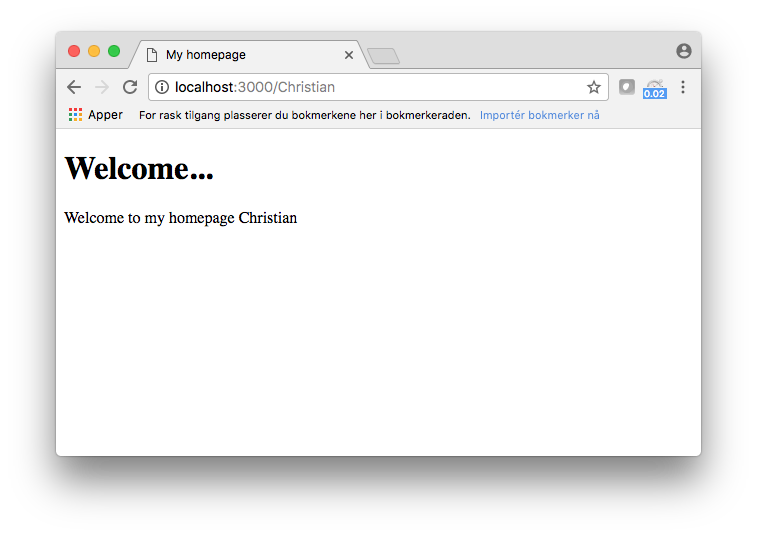

# simple-node-view
There is lots of template/view engines out there like Pug, EJS etc. to use with NodeJS web projects. These engines are rich on features, but also quite heavy and requires a certian level for getting started.

Imagine you have a smaller web project and just need a fast (in memory), extremely lightweight view engine to render your HTML templates. Well, that was why I wrote this module.

## Very very simple
First of all I have to say; lower your expectations. This module is very very simple, but that´s also the beauty of it I think. Your machine dosen´t need to walk through all these lines of unnecessary code for every request.

This module is 35 lines of code including comments and spaces. There is two function exports; load and get. What it simply does is to "load" all HTML templates from a directory in to an object in memory, then you use "get" to render a certian HTML template by replacing variables in the HTML file.

## Install
```
npm install simple-node-view
```

## Usage (with express)
HTML template (index.html):
```
<!DOCTYPE html>
<html>
  <head>
    <title>&title;</title>
 </head>
  <body>
    <h1>&header;</h1>>
    <p>&text; &name:</p>
</body>
</html>
```

Here is an example using the module with express
```
var express = require('express');
var view = require('simple-node-view');
var app = express();

view.load( { dir: './views/', format: '.html' })

app.get('/:name', function(req, res){

    var indexpage = {
        title: 'My homepage',
        header: 'Welcome...',
        text: 'Welcome to my homepage',
        name: req.params.name
    }

    content = view.get('index', indexpage);

    res.send(content);

});

app.listen(3000, function(err) {
    if(err) throw err;
    console.log('Listening');
});
```
This is what it looks like


## Updates
### 1.0.2
* Global updates of enteties in template

### 1.0.1:
* Removed unecessary code, version 1.0.1 published to npm.

### 1.0.0:
* Initial version released